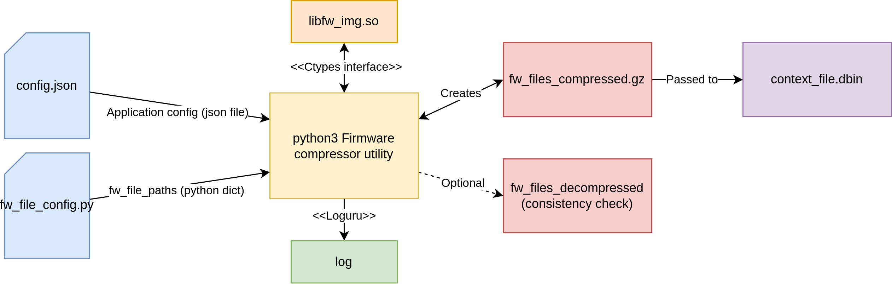

# Firmware compressor utility

## General description:



A simple Python utility to compress firmware files and create a firmware image for XCP reprogramming


## Package installation:
To install all the required Python3 packages use:

```
pip3 install -r requirements.txt
```

## How to use:

To run the utility, simply use the following command:

```
python3 main.py -file-paths [path to the out_collect ended with /]
```

or use:
```
python3 main.py
```
to run the utility without path specification. Default firmware image file path: **../out_collect/**

The utility supports a simple help message. To call it use:

```
python3 main.py -h
```

## Project directory/files description:

Directories:
- logs: this directory contains the utility log file;
- config: this directory contains the config.json file with general utility settings;
- compressed_files: This directory is used as a storage for compressed firmware binary files, which will then be converted into a firmware image. The contents of this folder will be automatically deleted after creating the firmware image and after each launch of the utility (so that old binary files do not conflict with fresh ones);
- decompressed_files: used as storage for decompressed binary files created during image integrity checking. The contents of this folder will be automatically deleted after a successful integrity check and after each launch of the utility;


## Config.json description

General structure of the config.json:

```
{
    "log_file_path":"logs/",
    "log_rotation_size":"500 MB",
    "log_filter_name":"compressor_app",
    "log_level":"INFO",

    "test_consistency_flag":1
}
```
- log_file_path: specifies the path to the log file;
- log_rotation_size: log file rotation size. The value must be in string format;
- log_filter_name: filter application label for the logger;
- log_level: logger debugging level;
- test_consistency_flag: enable (1) or disable (0) integrity checking of created firmware image files.

## How to remove partition from the fw_files.py

To remove the specific partition from the fw_files.py you should simply comment (or remove) the partition segment in the python dictionary. For example to remove MD_ABL partition:

```
md_fw_file_paths = {
#       "MD_ABL":
#           {"abl_fastboot.elf": fw_root_path + "qcom_qnx/apps/qnx_ap/target/hypervisor/astemo/abl-image-lemans/signed/abl_fastboot.elf"},
        "MD_AOP":
            {"aop.mbn": fw_root_path + "qcom_qnx/aop/aop_proc/build/ms/bin/AAAAANAZO/lemansau/4PMIC/aop.mbn"},
        "MD_BOOT":
            {"boot_qdrive.img": fw_root_path + "qcom_qnx/apps/qnx_ap/target/hypervisor/astemo/out_lemans/boot_qdrive.img"},
        "MD_CPUCP":
            {"cpucp.elf": fw_root_path+"qcom_qnx/cpucp/cpucp_proc/lemansau/cpucp/cpucp.elf"}
}
```

To undo the changes simply uncoment the desired partition in the fw_files.py.
